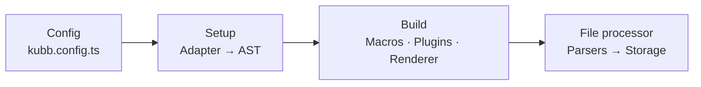
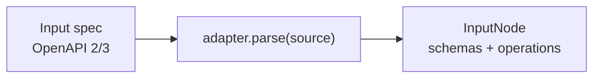
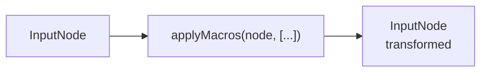
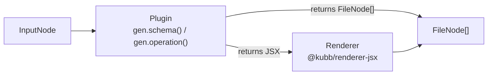
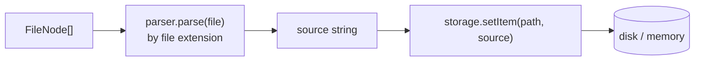

# Architecture

Kubb turns API specifications into code through a layered pipeline. The [adapter](/docs/5.x/concepts/adapters) parses the spec into a universal [AST](/docs/5.x/concepts/ast). [Macros](/docs/5.x/concepts/macros) rewrite AST nodes before a plugin reads them. [Plugins](/plugins) walk the AST and emit `FileNode`s. [Parsers](/docs/5.x/concepts/parsers) convert each `FileNode` into source code. [Storage](/docs/5.x/concepts/storage) writes the result to disk.

## Pipeline overview



## Config

`defineConfig` from the `kubb` package pre-wires [`adapterOas`](/docs/5.x/concepts/adapters), the default parsers [`parserTs`, `parserTsx`, `parserMd`](/docs/5.x/concepts/parsers), and [`pluginBarrel`](/plugins/plugin-barrel). A minimal config only needs `input` and `output`.

```typescript twoslash [kubb.config.ts]
import { defineConfig } from 'kubb'

export default defineConfig({
  input: { path: './petStore.yaml' },
  output: { path: './src/gen' },
  plugins: [],
})
```

> [!NOTE]
> Import from [`@kubb/core`](/docs/5.x/api/core) only when you need the lower-level API for programmatic builds or custom tooling.

## [Adapter](/docs/5.x/concepts/adapters)



An adapter converts an input specification into the universal [AST](/docs/5.x/concepts/ast). `adapter.parse(source)` returns an `InputNode`. `adapter.getImports(node, resolve)` tracks cross-references so plugins emit correct import paths.

Each adapter carries a dialect. The dialect is the one place where spec-specific schema questions live: nullability, `$ref` resolution, discriminators, binary detection, and schema deduplication. Everything past the adapter is generic JSON Schema, so plugins and parsers never branch on the source format.

The official adapter for OpenAPI 2.0, 3.0, and 3.1 is [`@kubb/adapter-oas`](/adapters/adapter-oas). `defineConfig` selects it automatically.

```typescript twoslash [kubb.config.ts]
import { defineConfig } from 'kubb'
import { adapterOas } from '@kubb/adapter-oas'

export default defineConfig({
  input: { path: './petStore.yaml' },
  output: { path: './src/gen' },
  adapter: adapterOas({ validate: true, dateType: 'date' }),
})
```

See [Adapters](/docs/5.x/concepts/adapters) for the full list of options and details on building a custom adapter.

## [AST](/docs/5.x/concepts/ast)

The AST is the intermediate representation between the [adapter](/docs/5.x/concepts/adapters) and the [plugins](/plugins). Every adapter produces an `InputNode`; every plugin consumes it. Plugins never read the raw spec, so the same plugin works with any adapter.

```text [Resulting tree]
InputNode
├── schemas: SchemaNode[]            (named, reusable schemas)
│   └── consumed by plugins          → FileNode (e.g. type aliases, enums)
└── operations: OperationNode[]
    ├── parameters: ParameterNode[]  → SchemaNode
    ├── requestBody?: RequestBodyNode → content: ContentNode[] → SchemaNode
    ├── responses: ResponseNode[]    → content: ContentNode[] → SchemaNode
    └── consumed by plugins          → FileNode (e.g. client functions, hooks)
```

[`@kubb/ast`](/docs/5.x/concepts/ast) ships three visitor patterns:

| Visitor                     | Purpose                                                               |
| --------------------------- | --------------------------------------------------------------------- |
| `walk(root, visitors)`      | Async traversal for logging, validation, and side effects.            |
| `transform(root, visitors)` | Produces a modified copy of the tree. Return `null` to remove a node. |
| `collect(root, visitors)`   | Gathers matching nodes into a flat array.                             |

## [Macros](/docs/5.x/concepts/macros)



Macros are the second layer of [`@kubb/ast`](/docs/5.x/concepts/ast). They are named, composable transforms that rewrite schema and operation nodes before a plugin's generators print code. Use them to rename symbols, retype fields, or normalize shapes without forking an adapter or a generator. They run on the shared AST, so the same macro works across every adapter and output target.

Macros run per plugin. One plugin's macros never change the nodes another plugin sees. Pass them through a plugin's `macros` option, or register them from `kubb:plugin:setup` with `addMacro`.

```typescript twoslash [kubb.config.ts]
// @noErrors
import { defineConfig } from 'kubb'
import { pluginTs } from '@kubb/plugin-ts'
import { macroSimplifyUnion } from '@kubb/ast/macros'

export default defineConfig({
  input: { path: './petStore.yaml' },
  output: { path: './src/gen' },
  plugins: [pluginTs({ macros: [macroSimplifyUnion] })],
})
```

See [Macros](/docs/5.x/concepts/macros) for writing macros, composing them, and the built-in presets.

## Plugins



Plugins walk the [AST](/docs/5.x/concepts/ast) and emit `FileNode`s. They run in array order; earlier plugins produce types that later plugins can import.

```typescript twoslash [kubb.config.ts]
// @noErrors
import { defineConfig } from 'kubb'
import { pluginTs } from '@kubb/plugin-ts'
import { pluginAxios } from '@kubb/plugin-axios'

export default defineConfig({
  input: { path: './petStore.yaml' },
  output: { path: './src/gen' },
  plugins: [pluginTs(), pluginAxios()],
})
```

### Types and clients

| Package                                         | Generates                                                                                                                               |
| ----------------------------------------------- | --------------------------------------------------------------------------------------------------------------------------------------- |
| [`@kubb/plugin-ts`](/plugins/plugin-ts)         | TypeScript types and interfaces                                                                                                         |
| [`@kubb/plugin-axios`](/plugins/plugin-axios)   | [Axios](https://axios-http.com) HTTP client functions                                                                                   |
| [`@kubb/plugin-fetch`](/plugins/plugin-fetch)   | [Fetch](https://developer.mozilla.org/en-US/docs/Web/API/Fetch_API) HTTP client functions                                              |

### Data-fetching hooks

| Package                                                   | Generates                                                    |
| --------------------------------------------------------- | ------------------------------------------------------------ |
| [`@kubb/plugin-react-query`](/plugins/plugin-react-query) | [TanStack Query](https://tanstack.com/query) hooks for React |
| [`@kubb/plugin-vue-query`](/plugins/plugin-vue-query)     | [TanStack Query](https://tanstack.com/query) hooks for Vue   |

### Validation and mocking

| Package                                       | Generates                                      |
| --------------------------------------------- | ---------------------------------------------- |
| [`@kubb/plugin-zod`](/plugins/plugin-zod)     | [Zod](https://zod.dev) validation schemas      |
| [`@kubb/plugin-faker`](/plugins/plugin-faker) | [Faker.js](https://fakerjs.dev) data factories |
| [`@kubb/plugin-msw`](/plugins/plugin-msw)     | [MSW](https://mswjs.io) request handlers       |

### Tooling

| Package                                           | Purpose                                                                                         |
| ------------------------------------------------- | ----------------------------------------------------------------------------------------------- |
| [`@kubb/plugin-cypress`](/plugins/plugin-cypress) | [Cypress](https://www.cypress.io) test scaffolding                                              |
| [`@kubb/plugin-redoc`](/plugins/plugin-redoc)     | Embeds [Redoc](https://redocly.com/docs/redoc/)-rendered API docs                               |
| [`@kubb/plugin-mcp`](/plugins/plugin-mcp)         | Generates [MCP](https://modelcontextprotocol.io)-compatible tools and schemas for AI assistants |

See the [plugins catalogue](/plugins) for the full list.

## Renderer

Plugins can use [`@kubb/renderer-jsx`](/docs/5.x/api/core) to describe generated files as React components instead of constructing `FileNode`s by hand.

> [!NOTE]
> `@kubb/renderer-jsx` is optional. Plugins that build `FileNode`s directly with factory functions from [`@kubb/ast`](/docs/5.x/concepts/ast) do not need it.

## [Parsers](/docs/5.x/concepts/parsers)



A parser converts a `FileNode` into a source string. Each parser declares which file extensions it handles. Kubb dispatches every emitted file to the first matching parser.

```typescript twoslash [kubb.config.ts]
import { defineConfig } from 'kubb'
import { parserTs, parserTsx } from '@kubb/parser-ts'

export default defineConfig({
  input: { path: './petStore.yaml' },
  output: { path: './src/gen' },
  parsers: [parserTs, parserTsx],
})
```

> [!IMPORTANT]
> When two parsers claim the same extension, the first one wins.

| Package                                 | Extensions                   | Description                                                                                                  |
| --------------------------------------- | ---------------------------- | ------------------------------------------------------------------------------------------------------------ |
| [`@kubb/parser-ts`](/parsers/parser-ts) | `.ts`, `.js`, `.tsx`, `.jsx` | Uses the TypeScript compiler to print, deduplicate, and resolve imports. Included automatically with `kubb`. |

## [Storage](/docs/5.x/concepts/storage)

The storage driver controls where Kubb writes generated files. Default is `fsStorage()`. Use `memoryStorage()` for testing, or implement `Storage` to target any backend.

```typescript twoslash [kubb.config.ts]
import { defineConfig } from 'kubb'
import { memoryStorage } from '@kubb/core'

export default defineConfig({
  input: { path: './petStore.yaml' },
  output: { path: './src/gen' },
  storage: memoryStorage(),
})
```

| Driver            | Description                                                                          |
| ----------------- | ------------------------------------------------------------------------------------ |
| `fsStorage()`     | Writes to disk. Skips unchanged files. Default.                                      |
| `memoryStorage()` | Stores output in a `Map`. Nothing touches disk. Ideal for tests.                     |
| Custom            | Implement `Storage` with `createStorage` to write to S3, a database, or any backend. |

## Foundation packages

| Package                                    | Purpose                                                                                                                                                                          |
| ------------------------------------------ | -------------------------------------------------------------------------------------------------------------------------------------------------------------------------------- |
| [`kubb`](/docs/5.x/api/core)               | Umbrella package. Exports `defineConfig` and bundles `adapterOas`, `parserTs`, `parserTsx`, `parserMd`, and `pluginBarrel` for a zero-config setup.                             |
| [`@kubb/core`](/docs/5.x/api/core)         | Lower-level runtime with `createKubb`, `definePlugin`, `defineParser`, `createAdapter`, and storage APIs. Use for programmatic generation or custom tooling.                     |
| [`@kubb/cli`](/docs/5.x/api/commands/)     | Provides the `kubb` command-line binary. Reads `kubb.config.ts` and runs the generation pipeline.                                                                                |
| [`@kubb/ast`](/docs/5.x/concepts/ast)      | Universal AST layer. Includes all node factories, `walk`, `transform`, `collect`, type guards, ref helpers, and the `defineDialect` and `optionality` helpers. The macro engine lives on the root and the presets on `@kubb/ast/macros`. |
| [`@kubb/parser-ts`](/parsers/parser-ts)    | TypeScript and TSX parser. Included automatically with the `kubb` package.                                                                                                       |
| [`@kubb/renderer-jsx`](/docs/5.x/api/core) | JSX-based rendering for plugins that build files from React components.                                                                                                          |

## Build-tool integrations

| Package                                    | Description                                                                                                                                                                                                                                                                                                           |
| ------------------------------------------ | --------------------------------------------------------------------------------------------------------------------------------------------------------------------------------------------------------------------------------------------------------------------------------------------------------------------- |
| [`unplugin-kubb`](/docs/5.x/integrations/) | Runs Kubb during your build via [unplugin](https://github.com/unjs/unplugin). Works with [Vite](https://vite.dev), [Rollup](https://rollupjs.org), [webpack](https://webpack.js.org), [esbuild](https://esbuild.github.io), [Rspack](https://rspack.dev), [Nuxt](https://nuxt.com), and [Astro](https://astro.build). |

See the [Integrations](/docs/5.x/integrations/) page for setup instructions for each build tool.

## Servers

| Package                                   | Purpose                                                                                                     |
| ----------------------------------------- | ---------------------------------------------------------------------------------------------------------- |
| [`@kubb/mcp`](/docs/5.x/api/commands/mcp) | Standalone [MCP](https://modelcontextprotocol.io) server that lets LLM clients trigger generation directly. |
