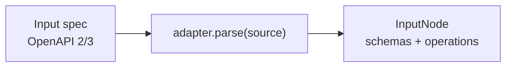
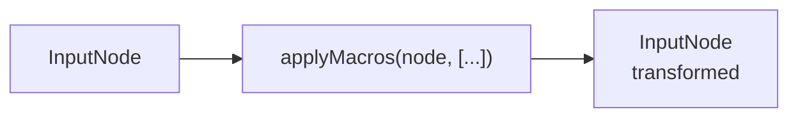
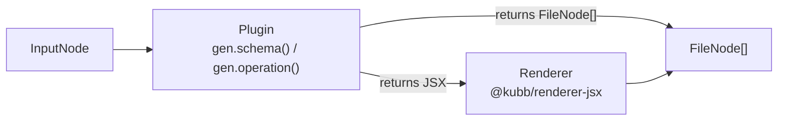
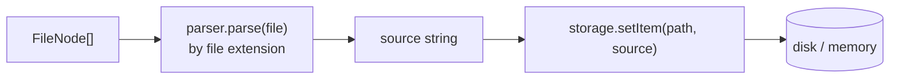

# Architecture

Kubb turns API specifications into code through a layered pipeline. The [adapter](/docs/5.x/guide/concepts/adapters) parses the spec into a universal [AST](/docs/5.x/guide/concepts/ast). [Macros](/docs/5.x/guide/going-further/macros) rewrite AST nodes before a plugin reads them. [Plugins](/plugins) walk the AST and emit `FileNode`s. [Parsers](/docs/5.x/guide/concepts/parsers) convert each `FileNode` into source code. [Storage](/docs/5.x/guide/concepts/storage) writes the result to disk.

## Pipeline overview

Every run moves through four stages. Select one to see what it does, or watch it play through from spec to files.

<ArchitecturePipeline />

## Config

`defineConfig` from the `kubb/config` subpath of the `kubb` package pre-wires [`adapterOas`](/docs/5.x/guide/concepts/adapters), the default parsers [`parserTs`, `parserTsx`, `parserMd`](/docs/5.x/guide/concepts/parsers), and [`pluginBarrel`](/plugins/plugin-barrel/). A minimal config only needs `input` and `output`.

```typescript twoslash [kubb.config.ts]
import { defineConfig } from 'kubb/config'

export default defineConfig({
  input: './petStore.yaml',
  output: { path: './src/gen' },
  plugins: [],
})
```

> [!NOTE]
> Reach for [`createKubb`](/docs/5.x/reference/kit/engine#createkubb) from the `kubb` package only when you need a programmatic build or custom tooling.

## [Adapter](/docs/5.x/guide/concepts/adapters)



An adapter converts an input specification into the universal [AST](/docs/5.x/guide/concepts/ast). `adapter.parse(source)` returns an `InputNode`, and `adapter.getImports(node, resolve)` tracks cross-references so plugins emit correct import paths.

Each adapter carries a dialect, and that dialect is the one place where spec-specific schema questions live: nullability, `$ref` resolution, discriminators, binary detection, and schema deduplication. Everything past the adapter is generic JSON Schema, so plugins and parsers never branch on the source format.

The official adapter for OpenAPI 2.0, 3.0, and 3.1 is [`@kubb/adapter-oas`](/adapters/adapter-oas/). `defineConfig` selects it automatically.

```typescript twoslash [kubb.config.ts]
import { defineConfig } from 'kubb/config'
import { adapterOas } from '@kubb/adapter-oas'

export default defineConfig({
  input: './petStore.yaml',
  output: { path: './src/gen' },
  adapter: adapterOas({ validate: true, dateType: 'date' }),
})
```

See [Adapters](/docs/5.x/guide/concepts/adapters) for the full list of options and details on building a custom adapter.

## [AST](/docs/5.x/guide/concepts/ast)

The AST is the intermediate representation between the [adapter](/docs/5.x/guide/concepts/adapters) and the [plugins](/plugins). Every adapter produces an `InputNode` and every plugin consumes it. Plugins never read the raw spec, so the same plugin works with any adapter.

```text [Resulting tree]
InputNode
├── schemas: SchemaNode[]            (named, reusable schemas)
│   └── consumed by plugins          → FileNode (e.g. type aliases, enums)
└── operations: OperationNode[]
    ├── parameters: ParameterNode[]  → SchemaNode
    ├── requestBody?: RequestBodyNode → content: ContentNode[] → SchemaNode
    ├── responses: ResponseNode[]    → content: ContentNode[] → SchemaNode
    └── consumed by plugins          → FileNode (e.g. client functions, hooks)
```

The [AST layer](/docs/5.x/guide/concepts/ast) ships two visitor patterns:

| Visitor                     | Purpose                                                                                             |
| --------------------------- | ---------------------------------------------------------------------------------------------------- |
| `transform(root, visitors)` | Produces a modified copy of the tree. Return a new node to replace one, or leave it untouched.       |
| `collect(root, visitors)`   | Gathers matching nodes into a flat array. Use it for logging, validation, and statistics passes too. |

## [Macros](/docs/5.x/guide/going-further/macros)



Macros are the second layer of the [AST](/docs/5.x/guide/concepts/ast). They are named, composable transforms that rewrite schema and operation nodes before a plugin's generators print code. Use them to rename symbols, retype fields, or normalize shapes without forking an adapter or a generator. Because they run on the shared AST, the same macro works across every adapter and output target.

Macros run per plugin, so one plugin's macros never change the nodes another plugin sees. Pass them through a plugin's `macros` option, or register them from `kubb:plugin:setup` with `addMacro`.

```typescript twoslash [kubb.config.ts]
// @noErrors
import { defineConfig } from 'kubb/config'
import { pluginTs } from '@kubb/plugin-ts'
import { ast } from 'kubb/kit'

export default defineConfig({
  input: './petStore.yaml',
  output: { path: './src/gen' },
  plugins: [pluginTs({ macros: [ast.macroSimplifyUnion] })],
})
```

See [Macros](/docs/5.x/guide/going-further/macros) for writing macros, composing them, and the built-in presets.

## Plugins



Plugins walk the [AST](/docs/5.x/guide/concepts/ast) and emit `FileNode`s. They run in array order, so earlier plugins produce types that later plugins can import.

```typescript twoslash [kubb.config.ts]
// @noErrors
import { defineConfig } from 'kubb/config'
import { pluginTs } from '@kubb/plugin-ts'
import { pluginAxios } from '@kubb/plugin-axios'

export default defineConfig({
  input: './petStore.yaml',
  output: { path: './src/gen' },
  plugins: [pluginTs(), pluginAxios()],
})
```

See the [plugins catalogue](/plugins) for the full list.

## Renderer

Plugins can use [`kubb/jsx`](/docs/5.x/reference/jsx), backed by `@kubb/renderer-jsx`, to describe generated files as React components instead of constructing `FileNode`s by hand.

> [!NOTE]
> `kubb/jsx` is optional. Plugins that build `FileNode`s directly with the `factory` node builders from [`kubb/kit`](/docs/5.x/reference/kit) do not need it.

## [Parsers](/docs/5.x/guide/concepts/parsers)



A parser converts a `FileNode` into a source string. Each parser declares which file extensions it handles, and Kubb dispatches every emitted file to the first matching parser.

```typescript twoslash [kubb.config.ts]
import { defineConfig } from 'kubb/config'
import { parserTs, parserTsx } from '@kubb/parser-ts'
import { parserMd } from '@kubb/parser-md'

export default defineConfig({
  input: './petStore.yaml',
  output: { path: './src/gen' },
  parsers: [parserTs(), parserTsx(), parserMd()],
})
```

> [!IMPORTANT]
> When two parsers claim the same extension, the first one wins.

| Package                                 | Extensions                   | Description                                                                                                  |
| --------------------------------------- | ---------------------------- | ------------------------------------------------------------------------------------------------------------ |
| [`@kubb/parser-ts`](/parsers/parser-ts/) | `.ts`, `.js`, `.tsx`, `.jsx` | Uses the TypeScript compiler to print, deduplicate, and resolve imports. Included automatically with `kubb`. |
| [`@kubb/parser-md`](/parsers/parser-md/) | `.md`, `.markdown`           | Writes Markdown files. Included automatically with `kubb`.                                                   |

## [Storage](/docs/5.x/guide/concepts/storage)

The storage driver controls where Kubb writes generated files. The default is `fsStorage()`. Use `memoryStorage()` for testing, or implement `Storage` to target any backend.

```typescript twoslash [kubb.config.ts]
import { defineConfig } from 'kubb/config'
import { memoryStorage } from 'kubb/kit'

export default defineConfig({
  input: './petStore.yaml',
  output: { path: './src/gen' },
  storage: memoryStorage(),
})
```

| Driver            | Description                                                                          |
| ----------------- | ------------------------------------------------------------------------------------ |
| `fsStorage()`     | Writes to disk. Skips unchanged files. Default.                                      |
| `memoryStorage()` | Stores output in a `Map`. Nothing touches disk. Ideal for tests.                     |
| Custom            | Implement `Storage` with `createStorage` to write to S3, a database, or any backend. |

## Integrations

| Package                                    | Description                                                                                                                                                                                                                                                                                                           |
| ------------------------------------------ | --------------------------------------------------------------------------------------------------------------------------------------------------------------------------------------------------------------------------------------------------------------------------------------------------------------------- |
| [`unplugin-kubb`](/docs/5.x/guide/integrations/) | Runs Kubb during your build via [unplugin](https://github.com/unjs/unplugin). Works with [Vite](https://vite.dev), [Rollup](https://rollupjs.org), [webpack](https://webpack.js.org), [esbuild](https://esbuild.github.io), [Rspack](https://rspack.dev), [Nuxt](https://nuxt.com), and [Astro](https://astro.build). |

See the [Integrations](/docs/5.x/guide/integrations/) page for setup instructions for each build tool.

## AI

| Package                                   | Purpose                                                                                                     |
| ----------------------------------------- | ---------------------------------------------------------------------------------------------------------- |
| [`kubb mcp`](/docs/5.x/reference/commands/mcp) | Built-in [MCP](https://modelcontextprotocol.io) server that lets LLM clients trigger generation directly. |
