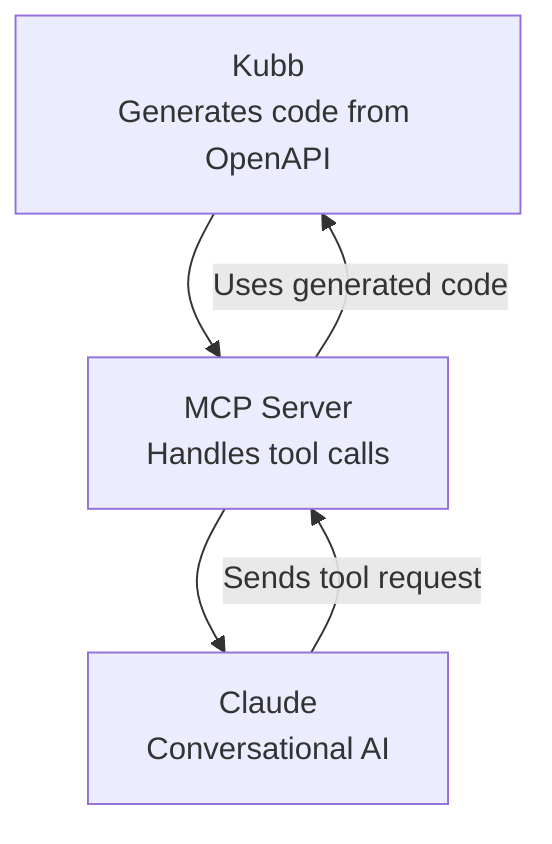
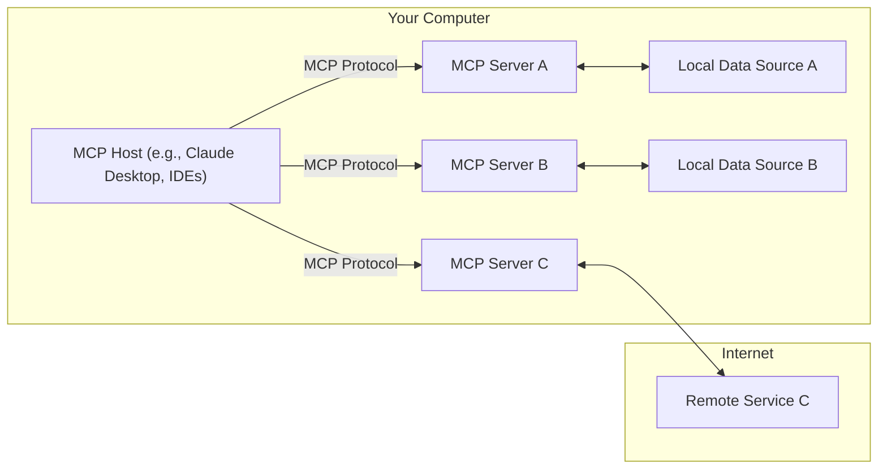

<script setup>
const mcpTree = [
  { name: 'src', type: 'dir', children: [
    { name: 'gen', type: 'dir', children: [
      { name: 'mcp', type: 'dir', children: [
        { name: 'addPet.ts' },
        { name: 'getPetById.ts' },
        { name: '.mcp.json' },
        { name: 'server.ts' },
      ] },
      { name: 'clients', type: 'dir', children: [
        { name: 'addPet.ts' },
        { name: 'getPetById.ts' },
      ] },
      { name: 'zod', type: 'dir', children: [
        { name: 'addPetSchema.ts' },
        { name: 'getPetByIdSchema.ts' },
      ] },
      { name: 'types', type: 'dir', children: [
        { name: 'AddPet.ts' },
        { name: 'GetPetById.ts' },
      ] },
      { name: 'index.ts' },
    ] },
  ] },
  { name: 'petStore.yaml' },
  { name: 'kubb.config.ts' },
  { name: 'package.json' },
]
</script>

# Set up Claude with Kubb


[Kubb](https://kubb.dev) and [Claude](https://claude.ai) connect over [MCP](https://modelcontextprotocol.io), the Model Context Protocol. Claude calls your API through plain conversation.

Kubb generates type-safe code from your OpenAPI spec, including the API client files, the Zod schemas, and an MCP server. Claude reads the MCP server and runs the matching API calls as you chat.





## Installation

Install [Claude desktop](https://claude.ai/download) and work through the [user quickstart](https://modelcontextprotocol.io/quickstart/user), then install Kubb with the [MCP plugin](/plugins/plugin-mcp/).

> [!TIP]
> The MCP plugin builds on the [OpenAPI adapter](/adapters/adapter-oas/), the [TypeScript](/plugins/plugin-ts/) and [Zod](/plugins/plugin-zod/) plugins, and a client plugin ([axios](/plugins/plugin-axios/) or [fetch](/plugins/plugin-fetch/)) to generate every file it needs.

::: code-group

```shell [bun]
bun add -d kubb@beta @kubb/plugin-ts@beta @kubb/plugin-zod@beta @kubb/plugin-axios@beta @kubb/plugin-mcp@beta
```

```shell [pnpm]
pnpm add -D kubb@beta @kubb/plugin-ts@beta @kubb/plugin-zod@beta @kubb/plugin-axios@beta @kubb/plugin-mcp@beta
```

```shell [npm]
npm install --save-dev kubb@beta @kubb/plugin-ts@beta @kubb/plugin-zod@beta @kubb/plugin-axios@beta @kubb/plugin-mcp@beta
```

```shell [yarn]
yarn add -D kubb@beta @kubb/plugin-ts@beta @kubb/plugin-zod@beta @kubb/plugin-axios@beta @kubb/plugin-mcp@beta
```

:::

## Define `kubb.config.ts`

Write a `kubb.config.ts` that sets up the [MCP](https://modelcontextprotocol.io) server.

`pluginMcp` depends on [`pluginTs`](/plugins/plugin-ts/) and [`pluginZod`](/plugins/plugin-zod/), and each handler calls a registered client plugin. Add [`pluginAxios`](/plugins/plugin-axios/) or [`pluginFetch`](/plugins/plugin-fetch/), and `pluginMcp` detects it.

> [!IMPORTANT]
> Set the `baseURL` on the client plugin so the generated handlers know which host to call.

```diff [kubb.config.ts]
import { defineConfig } from 'kubb/config'
import { pluginTs } from '@kubb/plugin-ts'
import { pluginZod } from '@kubb/plugin-zod'
import { pluginAxios } from '@kubb/plugin-axios'
import { pluginMcp } from '@kubb/plugin-mcp'

export default defineConfig({
  input: './petStore.yaml',
  output: {
    path: './src/gen',
  },
  plugins: [
    pluginTs(),
    pluginZod(),
    pluginAxios({
+      baseURL: 'https://petstore.swagger.io/v2',
    }),
    pluginMcp(),
  ],
})
```

## Generate MCP files

```shell [Terminal]
npx kubb@beta generate
```

## Inspect the generated files

The `src/mcp` folder holds the files that build an [MCP server](https://modelcontextprotocol.io) and connect [Claude](https://claude.ai/download) to your API.

<FileTree :tree="mcpTree" />

### src/mcp/addPet.ts

The `addPetHandler` function takes the pet body and calls the generated `addPet` client function. It returns the response as a JSON text message that [MCP](https://modelcontextprotocol.io) uses in conversations.

```typescript [src/mcp/addPet.ts]
import type { AddPetOptions } from '../types/AddPet'
import type { RequestHandlerExtra } from '@modelcontextprotocol/sdk/shared/protocol'
import type { CallToolResult, ServerNotification, ServerRequest } from '@modelcontextprotocol/sdk/types'
import { addPet } from '../clients/addPet'

export async function addPetHandler(
  { body }: AddPetOptions,
  request: RequestHandlerExtra<ServerRequest, ServerNotification>,
): Promise<Promise<CallToolResult>> {
  const res = await addPet({ body })

  return {
    content: [
      {
        type: 'text',
        text: JSON.stringify(res.data),
      },
    ],
    structuredContent: { data: res.data },
  }
}
```

### src/mcp/.mcp.json

This config registers an [MCP](https://modelcontextprotocol.io) server named `"Swagger PetStore - OpenAPI 3.0"`. The name comes from `info.title` in your OpenAPI file.

It runs the TypeScript server (`server.ts`) through `tsx`, so [MCP](https://modelcontextprotocol.io) handles tool calls over standard input and output.

```json [src/mcp/.mcp.json]
{
  "mcpServers": {
    "Swagger PetStore - OpenAPI 3.0": {
      "type": "stdio",
      "command": "npx",
      "args": ["tsx", "server.ts"]
    }
  }
}


```

### src/mcp/server.ts

This code starts an [MCP](https://modelcontextprotocol.io) server for the Swagger PetStore API in four steps:

1. Import the MCP SDK classes, each operation handler, and the Zod input schemas.
2. Create an MCP server named `"Swagger PetStore - OpenAPI 3.0"`.
3. Register the `addPet` tool. It validates the input against `addPetBodySchema` from the Zod plugin, then calls `addPetHandler`.
4. Connect the server to a `stdio` transport so it talks over standard input and output.

```typescript [src/mcp/server.ts]
import { McpServer } from '@modelcontextprotocol/sdk/server/mcp'
import { StdioServerTransport } from '@modelcontextprotocol/sdk/server/stdio'

import { addPetHandler } from './addPet'
import { addPetBodySchema, addPetStatus200Schema } from '../zod/addPetSchema'

export function getServer() {
  const server = new McpServer({
    name: 'Swagger PetStore - OpenAPI 3.0',
    version: '1.0.11',
  })

  server.registerTool(
    'addPet',
    {
      title: 'Add a new pet to the store',
      description: 'Add a new pet to the store',
      outputSchema: { data: addPetStatus200Schema },
      inputSchema: { body: addPetBodySchema },
    },
    async ({ body }, request) => {
      return addPetHandler({ body }, request)
    },
  )

  return server
}

export const server = getServer()

export async function startServer() {
  try {
    const transport = new StdioServerTransport()
    await server.connect(transport)
  } catch (error) {
    console.error('Failed to start server:', error)
    process.exit(1)
  }
}

startServer()
```

## Start Claude with the MCP server

Point [Claude](https://claude.ai) at your [MCP](https://modelcontextprotocol.io) server config (`src/mcp/.mcp.json`). Open Claude desktop and go to settings.


In the settings panel, open the `developer` section and click `edit config`. A window shows where the JSON file that lists your [MCP](https://modelcontextprotocol.io) servers lives.

> [!TIP]
> Manually navigate to:
>
> - Mac: `~/Library/Application Support/Claude/claude_desktop_config.json`
> - Windows: `%APPDATA%\Claude\claude_desktop_config.json`


Copy the content of `src/mcp/.mcp.json` so [Claude](https://claude.ai) picks up your [MCP](https://modelcontextprotocol.io) server.

> [!TIP]
> With multiple MCP servers, append your entry instead of overwriting the file.

For example:

```json [~/Library/Application Support/Claude/claude_desktop_config.json]
{
  "mcpServers": {
    "Swagger PetStore - OpenAPI 3.0": {
      "type": "stdio",
      "command": "npx",
      "args": ["tsx", "mcp/src/gen/mcp/server.ts"]
    },
    "github": {
      "command": "docker",
      "args": [
        "run",
        "-i",
        "--rm",
        "-e",
        "GITHUB_PERSONAL_ACCESS_TOKEN",
        "mcp/github"
      ],
      "env": {
        "GITHUB_PERSONAL_ACCESS_TOKEN": "<YOUR_TOKEN>"
      }
    }
  }
}
```

## Validate your MCP server

Quit [Claude](https://claude.ai) and reopen the desktop app. Click the button below to check that your [MCP](https://modelcontextprotocol.io) server is connected.


The view below opens and shows your generated [MCP](https://modelcontextprotocol.io) server.


## Use your MCP server

The prompt `create a random pet` reaches your [MCP](https://modelcontextprotocol.io) server. The server maps it to the `addPet` tool, which calls `addPetHandler` and creates the pet.


## See also

- [MCP setup](https://modelcontextprotocol.io)
- [Claude](https://claude.ai)
