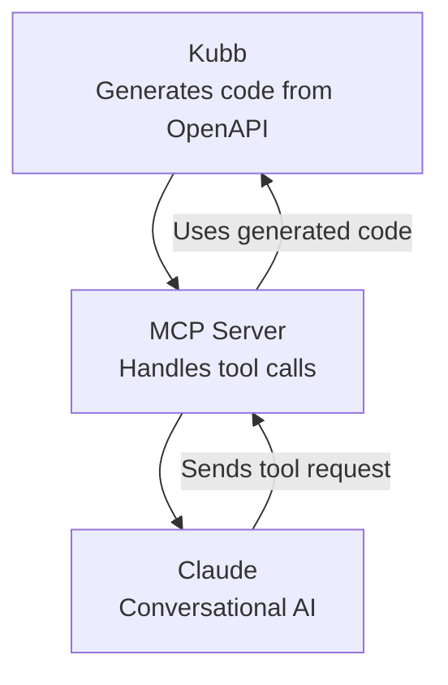
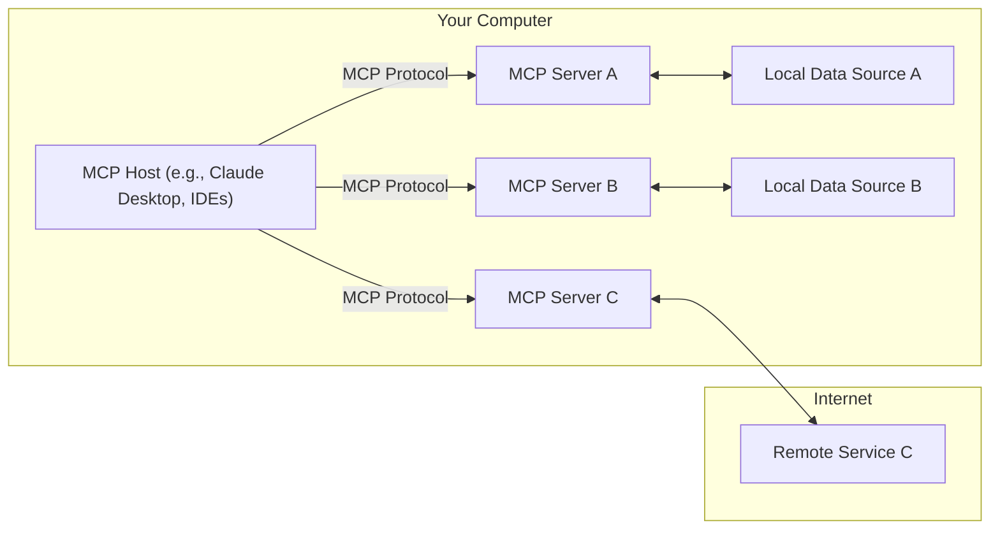

# Set up Claude with Kubb


[Kubb](https://kubb.dev) and [Claude](https://claude.ai) talk to each other over [MCP (Model Context Provider)](https://modelcontextprotocol.io), so Claude can call your API through plain conversation.

Kubb generates type-safe code from your OpenAPI spec: the API files, the Zod schemas, and the MCP server setup. Claude reads that MCP server and calls the endpoints as you chat with it. MCP is the wire between the two, carrying tool calls back and forth and keeping the conversation tied to your backend.

Put together, you describe what you want and Claude runs the matching API calls for you.





## Installation

Before you use [Claude](https://claude.ai), install [Claude desktop](https://claude.ai/download) and work through the [user quickstart](https://modelcontextprotocol.io/quickstart/user).

Install Kubb with the [MCP plugin](/plugins/plugin-mcp).

> [!IMPORTANT]
> Minimal Kubb version of `v3.10.0`.

> [!TIP]
> The MCP plugin uses the [OAS](/adapters/adapter-oas), [TypeScript](/plugins/plugin-ts), and [Zod](/plugins/plugin-zod) plugins to create all necessary files.

::: code-group

```shell [bun]
bun add -d @kubb/plugin-mcp@beta @kubb/adapter-oas@beta @kubb/plugin-ts@beta @kubb/plugin-zod@beta
```

```shell [pnpm]
pnpm add -D @kubb/plugin-mcp@beta @kubb/adapter-oas@beta @kubb/plugin-ts@beta @kubb/plugin-zod@beta
```

```shell [npm]
npm install --save-dev @kubb/plugin-mcp@beta @kubb/adapter-oas@beta @kubb/plugin-ts@beta @kubb/plugin-zod@beta
```

```shell [yarn]
yarn add -D @kubb/plugin-mcp@beta @kubb/adapter-oas@beta @kubb/plugin-ts@beta @kubb/plugin-zod@beta
```

:::

## Define `kubb.config.ts`

Define a `kubb.config.ts` file that sets up the [MCP](https://modelcontextprotocol.io) server.

> [!IMPORTANT]
> Define your `baseURL` so Claude knows which endpoints to call.

```typescript [kubb.config.ts] twoslash
import { defineConfig } from 'kubb'
import { adapterOas } from '@kubb/adapter-oas'
import { pluginTs } from '@kubb/plugin-ts'
import { pluginMcp } from '@kubb/plugin-mcp'
import { pluginZod } from '@kubb/plugin-zod'

export default defineConfig({
  input: {
    path: './petStore.yaml',
  },
  output: {
    path: './src/gen',
  },
  adapter: adapterOas(),
  plugins: [
    pluginTs(),
    pluginMcp({
      client: {
        baseURL: 'https://petstore.swagger.io/v2', // [!code ++]
      },
    }),
  ],
})
```

## Generate MCP files

Run the generate command to create the files.

```shell
npx kubb@beta generate
```

## Inspect generated files

The `src/mcp` folder holds the files that build an [MCP server](https://modelcontextprotocol.io) and connect [Claude](https://claude.ai/download) to your APIs.

```
.
├── src/
│   └── mcp/
│   │   ├── addPet.ts
│   │   └── getPet.ts
│   │   └── mcp.json
│   │   └── server.ts
│   └── zod/
│   │   ├── addPetSchema.ts
│   │   └── getPetSchema.ts
│   └── models/
│   │   ├── AddPet.ts
│   │   └── GetPet.ts
│   └── index.ts
├── petStore.yaml
├── kubb.config.ts
└── package.json
```

### src/mcp/addPet.ts

The `addPetHandler` function takes pet data, sends a POST request to the Swagger PetStore API to add the pet, and handles the response.

It returns the data as a JSON-formatted message that [MCP](https://modelcontextprotocol.io) uses in conversations.

```typescript [src/mcp/addPet.ts]
import client from '@kubb/plugin-clients/client/axios'
import type { AddPetMutationRequest, AddPetMutationResponse, AddPet405 } from '../models/AddPet'
import type { CallToolResult } from '@modelcontextprotocol/sdk/types'

export async function addPetHandler({ data }: { data: AddPetMutationRequest }): Promise<Promise<CallToolResult>> {
  const res = await client<AddPetMutationResponse, ResponseErrorConfig<AddPet405>, AddPetMutationRequest>({
    method: 'POST',
    url: '/pet',
    baseURL: 'https://petstore.swagger.io/v2',
    data,
  })
  return {
    content: [
      {
        type: 'text',
        text: JSON.stringify(res.data),
      },
    ],
  }
}
```

### src/mcp/mcp.json

This configuration registers an [MCP](https://modelcontextprotocol.io) server named `"Swagger PetStore - OpenAPI 3.0"`, taken from `info.title` in your OpenAPI or Swagger file.

It runs the TypeScript server (`server.ts`) through the `tsx` command, so [MCP](https://modelcontextprotocol.io) handles API tool calls over standard input and output.

```JSON [src/mcp/mcp.json]
{
  "mcpServers": {
    "Swagger PetStore - OpenAPI 3.0": {
      "type": "stdio",
      "command": "npx",
      "args": ["tsx", "/mcp/src/gen/mcp/server.ts"]
    }
  }
}


```

### src/mcp/server.ts

This code starts an [MCP](https://modelcontextprotocol.io) server that listens for the `"add a pet to the store"` tool call against the Swagger PetStore API from your OpenAPI or Swagger file. It works in four steps:

1. Imports the MCP SDK classes and the `addPetHandler` function.
2. Creates an MCP server named `"Swagger PetStore - OpenAPI 3.0"`.
3. Registers the `addPet` tool, which calls `addPetHandler` with pet data validated against `addPetMutationRequestSchema` (generated by the Zod plugin).
4. Connects the server to a `stdio` transport so it communicates through standard input and output.

```typescript [src/mcp/server.ts]
import { McpServer } from '@modelcontextprotocol/sdk/server/mcp'
import { StdioServerTransport } from '@modelcontextprotocol/sdk/server/stdio'

import { addPetHandler } from './addPet'
import { addPetMutationRequestSchema } from '../zod/addPetSchema'

export const server = new McpServer({
  name: 'Swagger PetStore - OpenAPI 3.0',
  version: '3.0.3',
})

server.tool('addPet', 'Add a new pet to the store', { data: addPetMutationRequestSchema }, async ({ data }) => {
  return addPetHandler({ data })
})

async function startServer() {
  try {
    const transport = new StdioServerTransport()
    await server.connect(transport)
  } catch (error) {
    console.error('Failed to start server:', error)
    process.exit(1)
  }
}

startServer()
```

## Start Claude with the MCP server

First, point [Claude](https://claude.ai) at your [MCP](https://modelcontextprotocol.io) server config file (`src/mcp/mcp.json`). Open Claude desktop and go to settings.


In the settings panel, open the `developer` section and click `edit config`. A window shows where the JSON file that lists all [MCP](https://modelcontextprotocol.io) servers lives.

> [!TIP]
> Manually navigate to:
>
> - Mac: `~/Library/Application Support/Claude/claude_desktop_config.json`
> - Windows: `%APPDATA%\Claude\claude_desktop_config.json`


Copy the content of `src/mcp/mcp.json` to make [Claude](https://claude.ai) aware of your [MCP](https://modelcontextprotocol.io) server.

> [!TIP]
> If you're using multiple MCP servers, remember to append the config instead of overriding it.

For example:

```JSON [~/Library/Application Support/Claude/claude_desktop_config.json]
{
  "mcpServers": {
    "Swagger PetStore - OpenAPI 3.0": {
      "type": "stdio",
      "command": "npx",
      "args": ["tsx", "mcp/src/gen/mcp/server.ts"]
    },
    "github": {
      "command": "docker",
      "args": [
        "run",
        "-i",
        "--rm",
        "-e",
        "GITHUB_PERSONAL_ACCESS_TOKEN",
        "mcp/github"
      ],
      "env": {
        "GITHUB_PERSONAL_ACCESS_TOKEN": "<YOUR_TOKEN>"
      }
    }
  }
}
```

## Validate your MCP server

Quit [Claude](https://claude.ai) and reopen the desktop app.

Then check that your [MCP](https://modelcontextprotocol.io) server is connected by clicking the button below.


The view below opens and shows your generated [MCP](https://modelcontextprotocol.io) server.


## Use your MCP server

Here, the prompt `create a random pet` calls your generated [MCP](https://modelcontextprotocol.io) server. The server maps the prompt to the `addPet` tool, which calls `addPetHandler` and creates the pet.


## See Also

- [MCP setup](https://modelcontextprotocol.io)
- [Claude](https://claude.ai)
