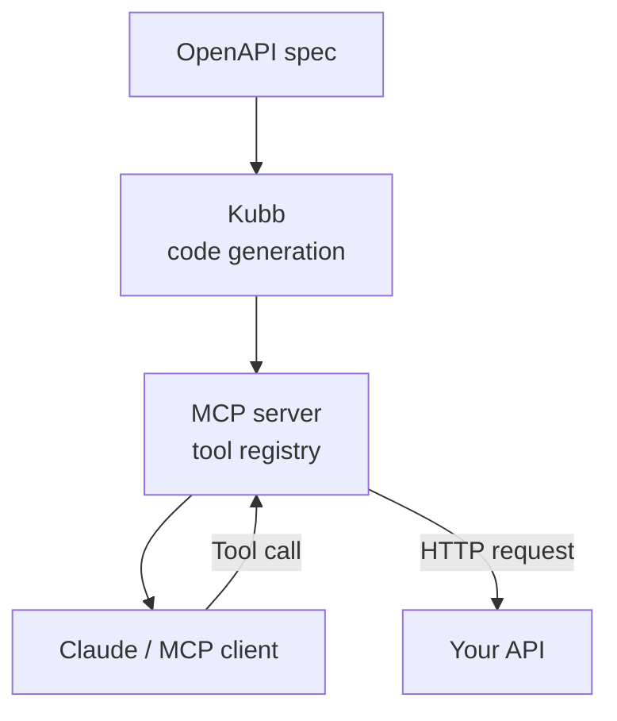

> [!TIP]
> See [Connect Claude to a remote MCP server](https://modelcontextprotocol.io/docs/tools/claude-desktop) for connecting the generated server.

# @kubb/plugin-mcp

Generate a [Model Context Protocol](https://modelcontextprotocol.io/introduction) server straight from your OpenAPI spec. Every operation becomes a typed MCP tool that AI assistants (Claude Desktop, Claude Code, MCP-compatible clients) can call directly.

The plugin emits the tool definitions, the request handlers, and the Zod schemas they validate against. Plug the generated server into Claude with one config file.



## Installation

::: code-group

```shell [bun]
bun add -d @kubb/plugin-mcp@beta
```

```shell [pnpm]
pnpm add -D @kubb/plugin-mcp@beta
```

```shell [npm]
npm install --save-dev @kubb/plugin-mcp@beta
```

```shell [yarn]
yarn add -D @kubb/plugin-mcp@beta
```

:::

## Options

### output

Where the generated MCP tool handlers are written and how they are exported.

|           |                                              |
| --------: | :------------------------------------------- |
|     Type: | `Output`                                     |
| Required: | `false`                                      |
|  Default: | `{ path: 'mcp', barrel: { type: 'named' } }` |

#### output.path

Folder where the plugin writes its generated code. The path is resolved against the global `output.path` set on `defineConfig`.

Use a folder to keep each generator's output isolated (`'types'`, `'clients'`, `'hooks'`). To put everything in one file, set `output.mode: 'file'` and point `path` at the target file including its extension (e.g. `'types.ts'`).

|           |          |
| --------: | :------- |
|     Type: | `string` |
| Required: | `true`   |
|  Default: | `'mcp'`  |

> [!TIP]
> `output.path` sets where files go, `output.mode` sets how many. Use `'directory'` (the default) for one file per operation, optionally grouped into subdirectories with the `group` option. Use `'file'` to write everything into a single file.

::: code-group

```typescript [kubb.config.ts]
import { defineConfig } from 'kubb'
import { pluginTs } from '@kubb/plugin-ts'

export default defineConfig({
  input: { path: './petStore.yaml' },
  output: { path: './src/gen' },
  plugins: [
    pluginTs({
      output: { path: './types' },
    }),
  ],
})
```

```text [Resulting tree]
src/
└── gen/
    └── types/
        ├── Pet.ts
        └── Store.ts
```

:::

#### output.mode

How the plugin consolidates its generated code into files.

- `'directory'` writes one file per operation or schema under `output.path`. This is the default.
- `'file'` writes everything into a single file. The `output.path` must include the file extension (e.g. `'types.ts'`, `'models.py'`).

|           |                         |
| --------: | :---------------------- |
|     Type: | `'directory' \| 'file'` |
| Required: | `false`                 |
|  Default: | `'directory'`           |

> [!TIP]
> Pair `'directory'` with the `group` option to organize output into per-tag or per-path subdirectories. `mode: 'file'` forbids `group` — a single-file output has nothing to group, and combining them stops the build with a `KUBB_INVALID_PLUGIN_OPTIONS` error.

::: code-group

```typescript [kubb.config.ts]
import { defineConfig } from 'kubb'
import { pluginTs } from '@kubb/plugin-ts'
import { pluginClient } from '@kubb/plugin-client'

export default defineConfig({
  input: { path: './petStore.yaml' },
  output: { path: './src/gen' },
  plugins: [
    pluginTs({
      output: { path: 'types.ts', mode: 'file' },
    }),
    pluginClient({
      output: { path: 'clients', mode: 'directory' },
      group: { type: 'tag' },
    }),
  ],
})
```

```text [Resulting tree]
src/
└── gen/
    ├── types.ts
    └── clients/
        ├── pet/
        │   └── getPetById.ts
        └── store/
            └── getInventory.ts
```

:::

#### output.barrel

Controls how the generated `index.ts` (barrel) file re-exports the plugin's output.

- `{ type: 'named' }` re-exports each symbol by name. Best for tree-shaking and explicit imports.
- `{ type: 'all' }` uses `export *`. Smaller barrel file, but exports everything.
- `{ nested: true }` creates a barrel in every subdirectory, so callers can import from any depth.
- `false` skips the barrel entirely. The plugin's files are also excluded from the root `index.ts`.

|           |                                                         |
| --------: | :------------------------------------------------------ |
|     Type: | `{ type: 'named' \| 'all', nested?: boolean } \| false` |
| Required: | `false`                                                 |
|  Default: | `{ type: 'named' }`                                     |

> [!TIP]
> Pick `'named'` when consumers care about which symbols they import (better tree-shaking, friendlier auto-import). Pick `'all'` when the file count is small and you want a one-line barrel.

::: code-group

```typescript ['named' (default)]
import { defineConfig } from 'kubb'
import { pluginTs } from '@kubb/plugin-ts'

export default defineConfig({
  input: { path: './petStore.yaml' },
  output: { path: './src/gen' },
  plugins: [
    pluginTs({
      output: { barrel: { type: 'named' } },
    }),
  ],
})
```

```typescript [src/gen/types/index.ts]
export { Pet, PetStatus } from './Pet'
export { Store } from './Store'
```

```typescript ['all']
import { defineConfig } from 'kubb'
import { pluginTs } from '@kubb/plugin-ts'

export default defineConfig({
  input: { path: './petStore.yaml' },
  output: { path: './src/gen' },
  plugins: [
    pluginTs({
      output: { barrel: { type: 'all' } },
    }),
  ],
})
```

```typescript [src/gen/types/index.ts]
export * from './Pet'
export * from './Store'
```

```typescript [nested]
import { defineConfig } from 'kubb'
import { pluginTs } from '@kubb/plugin-ts'

export default defineConfig({
  input: { path: './petStore.yaml' },
  output: { path: './src/gen' },
  plugins: [
    pluginTs({
      output: { barrel: { type: 'named', nested: true } },
    }),
  ],
})
```

```text [Generated tree]
src/gen/types/
├── index.ts          # re-exports ./pet and ./store
├── pet/
│   ├── index.ts      # re-exports Pet, Store, ...
│   └── Pet.ts
└── store/
    ├── index.ts
    └── Store.ts
```

```typescript [false]
import { defineConfig } from 'kubb'
import { pluginTs } from '@kubb/plugin-ts'

export default defineConfig({
  input: { path: './petStore.yaml' },
  output: { path: './src/gen' },
  plugins: [
    pluginTs({
      output: { barrel: false },
    }),
  ],
})
```

```text [Result]
# No index.ts is generated for this plugin.
# Its files are also excluded from the root index.ts.
```

:::

#### output.banner

Text prepended to every generated file. Useful for license headers, lint disables, or `@ts-nocheck` directives.

Pass a string for a static banner. Pass a function to compute the banner from each file's `RootNode` (the AST root containing path, schema, and operation context).

|           |                                          |
| --------: | :--------------------------------------- |
|     Type: | `string \| ((node: RootNode) => string)` |
| Required: | `false`                                  |

::: code-group

```typescript [Static banner]
import { defineConfig } from 'kubb'
import { pluginTs } from '@kubb/plugin-ts'

export default defineConfig({
  input: { path: './petStore.yaml' },
  output: { path: './src/gen' },
  plugins: [
    pluginTs({
      output: {
        banner: '/* eslint-disable */\n// @ts-nocheck',
      },
    }),
  ],
})
```

```typescript [Generated file]
/* eslint-disable */
// @ts-nocheck
export type Pet = {
  id: number
  name: string
}
```

```typescript [Dynamic banner]
import { defineConfig } from 'kubb'
import { pluginTs } from '@kubb/plugin-ts'

export default defineConfig({
  input: { path: './petStore.yaml' },
  output: { path: './src/gen' },
  plugins: [
    pluginTs({
      output: {
        banner: (node) => `// Source: ${node.path}\n// Generated at ${new Date().toISOString()}`,
      },
    }),
  ],
})
```

:::

#### output.footer

Text appended at the end of every generated file. The mirror of `banner` — use it for closing comments, re-enabling lint rules, or marker lines.

Pass a string for a static footer, or a function that receives the file's `RootNode` and returns the footer text.

|           |                                          |
| --------: | :--------------------------------------- |
|     Type: | `string \| ((node: RootNode) => string)` |
| Required: | `false`                                  |

::: code-group

```typescript [Re-enable lint after a banner disable]
import { defineConfig } from 'kubb'
import { pluginTs } from '@kubb/plugin-ts'

export default defineConfig({
  input: { path: './petStore.yaml' },
  output: { path: './src/gen' },
  plugins: [
    pluginTs({
      output: {
        banner: '/* eslint-disable */',
        footer: '/* eslint-enable */',
      },
    }),
  ],
})
```

:::

#### output.override

Allows the plugin to overwrite hand-written files that share a name with a generated file.

- `false` (default): Kubb skips a file if it already exists and is not marked as generated. This protects manual edits.
- `true`: Kubb overwrites any file at the target path, including hand-written ones.

|           |           |
| --------: | :-------- |
|     Type: | `boolean` |
| Required: | `false`   |
|  Default: | `false`   |

> [!WARNING]
> Enable this only when you are sure the target folder contains nothing you need to keep. Local edits are lost on the next generation.

::: code-group

```typescript [kubb.config.ts]
import { defineConfig } from 'kubb'
import { pluginTs } from '@kubb/plugin-ts'

export default defineConfig({
  input: { path: './petStore.yaml' },
  output: { path: './src/gen' },
  plugins: [
    pluginTs({
      output: { override: true },
    }),
  ],
})
```

:::

### resolver

Overrides how the plugin builds names and paths for generated files and symbols. Use this to add prefixes, suffixes, or to swap the casing strategy without forking the plugin.

Only override the methods you want to change. Anything you omit falls back to the plugin's default resolver. A method that returns `null` or `undefined` also falls back.

Inside each method, `this` is bound to the full resolver, so you can call `this.default(name, 'function')` to delegate to the built-in implementation.

|           |                                                |
| --------: | :--------------------------------------------- |
|     Type: | `Partial<ResolverMcp> & ThisType<ResolverMcp>` |
| Required: | `false`                                        |

> [!TIP]
> Use `resolver` for naming and file-location tweaks. For changing the AST nodes themselves (e.g. stripping descriptions), use `macros` instead.

```typescript [Prefix every tool name with "Mcp"]
import { defineConfig } from 'kubb'
import { pluginMcp } from '@kubb/plugin-mcp'

export default defineConfig({
  input: { path: './petStore.yaml' },
  output: { path: './src/gen' },
  plugins: [
    pluginMcp({
      resolver: {
        resolveName(name) {
          return `Mcp${this.default(name, 'function')}`
        },
      },
    }),
  ],
})
```

Each plugin ships with a default resolver:

| Plugin                 | Default resolver  |
| ---------------------- | ----------------- |
| `@kubb/plugin-ts`      | `resolverTs`      |
| `@kubb/plugin-zod`     | `resolverZod`     |
| `@kubb/plugin-faker`   | `resolverFaker`   |
| `@kubb/plugin-cypress` | `resolverCypress` |
| `@kubb/plugin-msw`     | `resolverMsw`     |
| `@kubb/plugin-mcp`     | `resolverMcp`     |
| `@kubb/plugin-client`  | `resolverClient`  |

### group

Splits generated files into subfolders based on the operation's tag, so each tag in your OpenAPI spec gets its own directory.

Without `group`, every file lands in the plugin's `output.path` folder. With `group`, files are bucketed under `{output.path}/{groupName}/`, where `groupName` is derived from the operation's first tag.

|           |         |
| --------: | :------ |
|     Type: | `Group` |
| Required: | `false` |

> [!TIP]
> Use `group` to mirror your API's domain structure (pet, store, user) in the generated code. Combine it with `output.barrel: { type: 'named', nested: true }` to get per-tag barrel files.
>
> `group` only applies to `output.mode: 'directory'` (the default), where each group becomes a folder. It is not valid with `output.mode: 'file'` — a single-file output has no grouping concept.

::: code-group

```typescript [kubb.config.ts]
import { defineConfig } from 'kubb'
import { pluginTs } from '@kubb/plugin-ts'

export default defineConfig({
  input: { path: './petStore.yaml' },
  output: { path: './src/gen' },
  plugins: [
    pluginTs({
      group: { type: 'tag' },
    }),
  ],
})
```

:::

With the configuration above, the generator emits one folder per tag, named after the camelCased tag:

```text
src/gen/
├── pet/
│   ├── AddPet.ts
│   └── GetPet.ts
└── store/
    ├── CreateStore.ts
    └── GetStoreById.ts
```

Pass `group.name` to customize the folder name, for example `name: ({ group }) => \`${group}Controller\``to keep the pre-v5`petController/` layout.

#### group.type

Property used to assign each operation to a group. Required whenever `group` is set.

Today only `'tag'` is supported: Kubb reads the first tag on the operation (`operation.getTags().at(0)?.name`) and uses it as the group key. Operations without a tag are placed in a default group.

|           |         |
| --------: | :------ |
|     Type: | `'tag'` |
| Required: | `true`  |

> [!NOTE]
> `Required: true*` is conditional — only required when the parent `group` option is used. `group` itself stays optional.

#### group.name

Function that builds the folder/identifier name from a group key (the operation's first tag).

|           |                                     |
| --------: | :---------------------------------- |
|     Type: | `(context: GroupContext) => string` |
| Required: | `false`                             |
|  Default: | `(ctx) => \`${ctx.group}\``         |

### paramsCasing

Renames parameter properties in the generated MCP handlers. The HTTP layer still uses the original spec names — Kubb adds the mapping for you.

|           |               |
| --------: | :------------ |
|     Type: | `'camelcase'` |
| Required: | `false`       |

> [!IMPORTANT]
> Set the same `paramsCasing` here as on `@kubb/plugin-ts` so the handlers' parameter types line up with the generated request types.

::: code-group

```typescript [With paramsCasing: 'camelcase']
// Handler signature uses camelCase
export async function findPetsByStatusHandler({ stepId }: { stepId: FindPetsByStatusPathParams['stepId'] }): Promise<CallToolResult> {
  const step_id = stepId

  const res = await fetch({
    method: 'GET',
    url: `/pet/findByStatus/${step_id}`,
  })
  // ...
}
```

```typescript [Without paramsCasing]
export async function findPetsByStatusHandler({ step_id }: { step_id: FindPetsByStatusPathParams['step_id'] }): Promise<CallToolResult> {
  const res = await fetch({
    method: 'GET',
    url: `/pet/findByStatus/${step_id}`,
  })
  // ...
}
```

:::

### client

HTTP client used by each MCP handler to call the underlying API. Mirrors a subset of `pluginClient` options.

|           |                                                                                         |
| --------: | :-------------------------------------------------------------------------------------- |
|     Type: | `ClientImportPath & { clientType?, dataReturnType?, baseURL?, bundle?, paramsCasing? }` |
| Required: | `false`                                                                                 |

#### client.importPath

Path or module specifier of a custom client module. Generated code imports its HTTP runtime from here instead of `@kubb/plugin-client/clients/{client}`.

Use this when you need to inject auth headers, add interceptors, change the base URL at runtime, or wrap a different HTTP library (ky, ofetch, ...). Both relative paths (`./src/client.ts`) and bare specifiers (`@my-org/api-client`) work.

|           |          |
| --------: | :------- |
|     Type: | `string` |
| Required: | `false`  |

> [!TIP]
> See the [custom client guide](https://kubb.dev/plugins/plugin-client#importpath) for a worked example.

> [!IMPORTANT]
> When used with query plugins (`@kubb/plugin-react-query`, `@kubb/plugin-vue-query`), generated hooks also import a `Client` type alias. Your module **must** export `Client`, `RequestConfig`, and `ResponseErrorConfig` — TypeScript will fail the import otherwise.

```typescript [src/client.ts]
import axios from 'axios'

export type RequestConfig<TData = unknown> = {
  url?: string
  method: 'GET' | 'PUT' | 'PATCH' | 'POST' | 'DELETE'
  params?: object
  data?: TData | FormData
  responseType?: 'arraybuffer' | 'blob' | 'document' | 'json' | 'text' | 'stream'
  signal?: AbortSignal
  headers?: HeadersInit
}

export type ResponseConfig<TData = unknown> = {
  data: TData
  status: number
  statusText: string
}

export type ResponseErrorConfig<TError = unknown> = TError

// Required when used with @kubb/plugin-react-query or @kubb/plugin-vue-query
export type Client = <TData, _TError = unknown, TVariables = unknown>(config: RequestConfig<TVariables>) => Promise<ResponseConfig<TData>>

const client: Client = async (config) => {
  const response = await axios.request<TData>({
    ...config,
    headers: {
      Authorization: `Bearer ${process.env.API_TOKEN}`,
      ...config.headers,
    },
  })

  return response
}

export default client
```

::: code-group

```typescript [Wire up a custom client]
import { defineConfig } from 'kubb'
import { pluginClient } from '@kubb/plugin-client'

export default defineConfig({
  input: { path: './petStore.yaml' },
  output: { path: './src/gen' },
  plugins: [
    pluginClient({
      importPath: './src/client.ts',
    }),
  ],
})
```

:::

##### When to use `importPath`

Reach for a custom client when you need to:

- Add an auth token to every request.
- Plug in interceptors, retries, or logging.
- Configure `baseURL` and headers from environment variables.
- Wrap a library other than `axios`/`fetch`.

##### Default behavior

Without `importPath`:

- `bundle: false` (default) — generated code imports from `@kubb/plugin-client/clients/{axios|fetch}`.
- `bundle: true` — Kubb writes `.kubb/client.ts` and generated code imports from there.

##### Required exports

The module pointed to by `importPath` must satisfy the same shape as the built-in client. At minimum:

- A default export of the `client` function.
- A `RequestConfig` type.
- A `ResponseErrorConfig` type.

When used together with a query plugin (`@kubb/plugin-react-query`, `@kubb/plugin-vue-query`), it must also export a `Client` type alias.

##### How generated files import it

Generated code imports the client as a default import (bound to the local name `client`) and the runtime types as named type imports:

```typescript
import client from '${client.importPath}'
import type { RequestConfig, ResponseErrorConfig } from '${client.importPath}'
// ... rest of the generated file
```

#### client.dataReturnType

Shape of the value returned from each generated client function.

- `'data'` returns only the response body (`response.data`).
- `'full'` returns a discriminated union keyed by HTTP status code. Each member is `{ status: N; data: StatusNType; statusText: string }`. Narrowing on `res.status` also narrows `res.data` to the matching response type.

|           |                    |
| --------: | :----------------- |
|     Type: | `'data' \| 'full'` |
| Required: | `false`            |
|  Default: | `'data'`           |

::: code-group

```typescript ['data' (default)]
export async function getPetById<TData>(petId: GetPetByIdPathParams): Promise<ResponseConfig<TData>['data']> {
  // ...
}
```

```typescript [usage.ts]
const pet = await getPetById(1)
//    ^? Pet
```

```typescript ['full']
export async function addPet(data: AddPetData, config = {}) {
  const res = await request<AddPetStatus200 | AddPetStatus405, ...>(...)
  return res as
    | { status: 200; data: AddPetStatus200; statusText: string }
    | { status: 405; data: AddPetStatus405; statusText: string }
}
```

```typescript [usage.ts]
const res = await addPet(petData)
if (res.status === 405) {
  res.data // narrowed to AddPetStatus405
}
```

:::

#### client.baseURL

Base URL prepended to every request URL in the generated client. When omitted, the URL comes from the OpenAPI spec's `servers[0].url` (or whichever index the adapter is configured to read).

Set this when the generated client should point at a different environment (staging, production) than the one written in the spec.

|           |          |
| --------: | :------- |
|     Type: | `string` |
| Required: | `false`  |

::: code-group

```typescript [Override the spec's server URL]
import { defineConfig } from 'kubb'
import { pluginClient } from '@kubb/plugin-client'

export default defineConfig({
  input: { path: './petStore.yaml' },
  output: { path: './src/gen' },
  plugins: [
    pluginClient({
      baseURL: 'https://petstore.swagger.io/v2',
    }),
  ],
})
```

:::

#### client.clientType

Shape of the underlying client the handlers call into. Mirrors `pluginClient`'s `clientType` option.

|           |                                          |
| --------: | :--------------------------------------- |
|     Type: | `'function' \| 'class' \| 'staticClass'` |
| Required: | `false`                                  |

#### client.bundle

Copies the HTTP client runtime into the generated output so consumers do not need `@kubb/plugin-client` at runtime. Mirrors `pluginClient`'s `bundle` option.

|           |           |
| --------: | :-------- |
|     Type: | `boolean` |
| Required: | `false`   |

#### client.paramsCasing

Renames parameter properties passed to the underlying client. Mirrors `pluginClient`'s `paramsCasing` option.

|           |               |
| --------: | :------------ |
|     Type: | `'camelcase'` |
| Required: | `false`       |

### include

Restricts generation to operations that match at least one entry in the list. Anything not matched is skipped.

Each entry filters by one of:

- `tag` — the operation's first tag in the OpenAPI spec.
- `operationId` — the operation's `operationId`.
- `path` — the URL pattern (`'/pet/{petId}'`).
- `method` — HTTP method (`'get'`, `'post'`, ...).
- `contentType` — the media type of the request body.

`pattern` accepts either a string (exact match) or a `RegExp` for fuzzy matches.

|           |                  |
| --------: | :--------------- |
|     Type: | `Array<Include>` |
| Required: | `false`          |

```typescript [Type definition]
export type Include = {
  type: 'tag' | 'operationId' | 'path' | 'method' | 'contentType'
  pattern: string | RegExp
}
```

::: code-group

```typescript [Only the pet tag]
import { defineConfig } from 'kubb'
import { pluginTs } from '@kubb/plugin-ts'

export default defineConfig({
  input: { path: './petStore.yaml' },
  output: { path: './src/gen' },
  plugins: [
    pluginTs({
      include: [{ type: 'tag', pattern: 'pet' }],
    }),
  ],
})
```

```typescript [Only GET operations under /pet]
import { defineConfig } from 'kubb'
import { pluginTs } from '@kubb/plugin-ts'

export default defineConfig({
  input: { path: './petStore.yaml' },
  output: { path: './src/gen' },
  plugins: [
    pluginTs({
      include: [
        { type: 'method', pattern: 'get' },
        { type: 'path', pattern: /^\/pet/ },
      ],
    }),
  ],
})
```

:::

### exclude

Skips any operation that matches at least one entry in the list. The opposite of `include`.

Each entry filters by one of:

- `tag` — the operation's first tag.
- `operationId` — the operation's `operationId`.
- `path` — the URL pattern (`'/pet/{petId}'`).
- `method` — HTTP method (`'get'`, `'post'`, ...).
- `contentType` — the media type of the request body.

`pattern` accepts a plain string or a `RegExp`. When both `include` and `exclude` are set, `exclude` wins.

|           |                  |
| --------: | :--------------- |
|     Type: | `Array<Exclude>` |
| Required: | `false`          |

```typescript [Type definition]
export type Exclude = {
  type: 'tag' | 'operationId' | 'path' | 'method' | 'contentType'
  pattern: string | RegExp
}
```

::: code-group

```typescript [Skip everything under the store tag]
import { defineConfig } from 'kubb'
import { pluginTs } from '@kubb/plugin-ts'

export default defineConfig({
  input: { path: './petStore.yaml' },
  output: { path: './src/gen' },
  plugins: [
    pluginTs({
      exclude: [{ type: 'tag', pattern: 'store' }],
    }),
  ],
})
```

```typescript [Skip a specific operation and all delete methods]
import { defineConfig } from 'kubb'
import { pluginTs } from '@kubb/plugin-ts'

export default defineConfig({
  input: { path: './petStore.yaml' },
  output: { path: './src/gen' },
  plugins: [
    pluginTs({
      exclude: [
        { type: 'operationId', pattern: 'deletePet' },
        { type: 'method', pattern: 'delete' },
      ],
    }),
  ],
})
```

:::

### override

Applies a different set of plugin options to operations that match a pattern. Use this when most of your API should follow the global config, but a handful of endpoints need different treatment.

Each entry has the same `type` and `pattern` shape as `include`/`exclude`, plus an `options` object that overrides the plugin's options for matched operations.

Entries are evaluated top to bottom. The first matching entry's `options` is merged onto the plugin defaults; later entries do not stack.

|           |                   |
| --------: | :---------------- |
|     Type: | `Array<Override>` |
| Required: | `false`           |

```typescript [Type definition]
export type Override = {
  type: 'tag' | 'operationId' | 'path' | 'method' | 'contentType'
  pattern: string | RegExp
  options: PluginOptions
}
```

::: code-group

```typescript [Use a different enum style for the user tag]
import { defineConfig } from 'kubb'
import { pluginTs } from '@kubb/plugin-ts'

export default defineConfig({
  input: { path: './petStore.yaml' },
  output: { path: './src/gen' },
  plugins: [
    pluginTs({
      enumType: 'asConst',
      override: [
        {
          type: 'tag',
          pattern: 'user',
          options: { enumType: 'literal' },
        },
      ],
    }),
  ],
})
```

:::

### generators

Adds custom generators that run alongside the plugin's built-in generators. Each generator can emit additional files or post-process existing ones using the plugin's AST and options.

Use this when you need output the plugin does not produce out of the box (a custom client wrapper, an extra index, a metadata file). For end-to-end guidance, see [Creating plugins](https://kubb.dev/docs/5.x/guides/creating-plugins).

|           |                               |
| --------: | :---------------------------- |
|     Type: | `Array<Generator<PluginMcp>>` |
| Required: | `false`                       |

> [!WARNING]
> Generators are an experimental, low-level API. The signature may change between minor releases.

### macros

Rewrite AST nodes before they are printed to source code. Use this when you need to rewrite operation IDs, drop descriptions, or change schema metadata without forking the generator.

Each [macro](/docs/5.x/concepts/macros) callback (e.g. `schema`, `operation`) receives the node and a context object. Return a new node to replace it, or return `undefined` to leave it untouched. Callbacks you omit keep the plugin's default behavior. Macros run in order, so a later macro sees the output of an earlier one.

|           |                 |
| --------: | :-------------- |
|     Type: | `Array<Macro>`  |
| Required: | `false`         |

> [!TIP]
> Use `macros` to rewrite node properties before printing. For changing the names of generated symbols and files, use `resolver` instead.

::: code-group

```typescript [Strip descriptions before printing]
import { defineConfig } from 'kubb'
import { pluginTs } from '@kubb/plugin-ts'

export default defineConfig({
  input: { path: './petStore.yaml' },
  output: { path: './src/gen' },
  plugins: [
    pluginTs({
      macros: [
        {
          name: 'strip-descriptions',
          schema(node) {
            return { ...node, description: undefined }
          },
        },
      ],
    }),
  ],
})
```

```typescript [Prefix every operationId]
import { defineConfig } from 'kubb'
import { pluginTs } from '@kubb/plugin-ts'

export default defineConfig({
  input: { path: './petStore.yaml' },
  output: { path: './src/gen' },
  plugins: [
    pluginTs({
      macros: [
        {
          name: 'prefix-operation-id',
          operation(node) {
            return { ...node, operationId: `api_${node.operationId}` }
          },
        },
      ],
    }),
  ],
})
```

:::

## Dependencies

This plugin requires the following plugins to be installed:

- [`@kubb/plugin-ts`](/plugins/plugin-ts)
- [`@kubb/plugin-client`](/plugins/plugin-client)
- [`@kubb/plugin-zod`](/plugins/plugin-zod)

## Example

::: code-group

```typescript [kubb.config.ts]
import { defineConfig } from 'kubb'
import { pluginTs } from '@kubb/plugin-ts'
import { pluginClient } from '@kubb/plugin-client'
import { pluginZod } from '@kubb/plugin-zod'
import { pluginMcp } from '@kubb/plugin-mcp'

export default defineConfig({
  input: { path: './petStore.yaml' },
  output: { path: './src/gen' },
  plugins: [
    pluginTs(),
    pluginClient(),
    pluginZod(),
    pluginMcp({
      output: { path: 'mcp', barrel: { type: 'named' } },
      client: {
        baseURL: 'https://petstore.swagger.io/v2',
      },
      group: {
        type: 'tag',
        name: ({ group }) => `${group}Handlers`,
      },
    }),
  ],
})
```

:::
